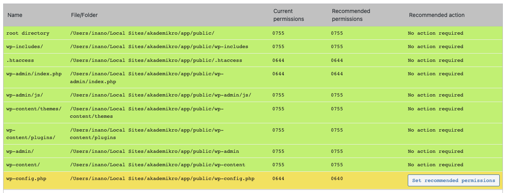

### Wordpress Web Siteleri Temel Güvenlik Önlemleri

1. **Sürümler:**
    * Deprecated sürümler kullanılmamalı
    * Wordpress son sürümünde mi?
    * PHP Güncel sürümünde mi?
    * Tüm pluginler son sürümünde mi?
    * Veritabanı altyapısı güncel sürümünde mi?
2. **Domain**
    * Domain SSL sertifikası var mı?
    * Non SSL versiton SSL'e yönleniyor mu? http >> https
    * www versiyon yönleniyor mu? 

3. **Dosyalar ve Dizin** **Yetkileri**
    * Klasörler 755
    * Dosyalar 644	
    * .htaccess , wp-config.php 640
    * Dosya sahibi : www-data veya non-root user
    * **Bash Script : **


    ~~~
       chown www-data:www-data  -R * # Let Apache be owner
       find . -type d -exec chmod 755 {} \;  # Change directory permissions rwxr-xr-x
       find . -type f -exec chmod 644 {} \;  # Change file permissions rw-r--r–
    ~~~





4. **Genel Önlemler**
    * wp-admin/ giriş adresinin değiştirilmesi ( panel, yonetim, vb )
    * wp-admin/ login recaptcha robot değilim onay kutulu v2 
    * Tahmin edilebilir , ( Admin veya domain adında )  kullanıcısının bulunmaması
    * Commentler kapalı olmalı.
    * Silinebilecek **gereksiz** WP dosyaları ( güvenlik açığı oluşturabilir )
        * /licence.txt
        * /readme.html
        * /wp-trackback.php
        * /xmlrpc.php
        * /wp-comments-sample.php
    * Remove wp version from source
5. **Development** dosyalarının silinmesi
    *  **Site root dizinde:**
        * test.php, info.php vb özellikle phpinfo gösteren dosya ve benzerleri **production **da  silinmeli.
        * **FTP programları** config dökümanları ( .ftpconfig .sitesettnigs .vb ) Kök dizinde olmamalı.
        * Javascript kaynak dosyaları .min versiyonu kullanılmalı.
        * Console.log kapalı olmalı.
        * wp-config.php 
        * SALT key ler güncellenmeli. [https://api.wordpress.org/secret-key/1.1/salt/](https://api.wordpress.org/secret-key/1.1/salt/)
        * Loglama aktif ve görünmez olmalı
        * **wp-config.php ye ekle**


    ```
        ini_set('display_startup_errors', 1);
        ini_set('display_errors', 1);
        $today =  date('y-m-d');
        error_reporting(E_ALL);
        define( 'WP_DEBUG', true );
        define( 'WP_DEBUG_DISPLAY', false  );
        define( 'WP_DEBUG_LOG', 'wp-content/uploads/logs/debug-'.$today.'.log' );
        // do not save post revisions
        define('WP_POST_REVISIONS', false);
        // Do not update WP core automaticaly
        define( 'WP_AUTO_UPDATE_CORE', false );
        // Disable file modification and plugin install from panel
        define('DISALLOW_FILE_MODS', true);
        define('DISALLOW_FILE_EDIT', true);
        // define('WP_DISABLE_FATAL_ERROR_HANDLER',true);
    ```


6. **Database**
    * DB Prefix wp_ den farklı olmalı
    * **DBUSER** **root olmamalı**.
    * Sadece bu sitenin DB sine erişebilecek bir kullanıcı olmalı. 

7. **Pluginler**
    * İnaktif pluginler silinmeli
    * Tüm pluginler son sürümünde olmalı
    * Wp All In One Security tavsiye ediliyor.
    * Disable REST API tavsiye ediliyor
    * Safe SVG tavsiye ediliyor 

8. **Ideal Deployment Cycle:**
    * Wordpress ve Pluginler panel üzerinden güncellenir
    * **Aktif theme development** yapılıyor ise ; 
        * Geliştirmesi yapılan temalar bu kategoride. 
        * Sadece **/wp-content/themes/tema_adi/ **içerisinde güncelleme olur.**
        * **Local development** ortamı kurulur, geliştirmeler burada yapılır
        * **Staging domain** var ise, lokal geliştirmeler buraya remote FTP ile push edilir
        * Staging domain, **Production’a** aktarılır
        * Sadece Production Domain ise;
            * Dosya ve Veritabanı Yedekleri alınır.
            * Localde test edilen scriptler Production ‘a remote FTP aracıyla yüklenir.
    * **Aktif development yok ise:**
        * Satın alınmış temalar bu kategoride. 
        * Sadece production domain ve panel üzerinden güncellemeler yapılır.
